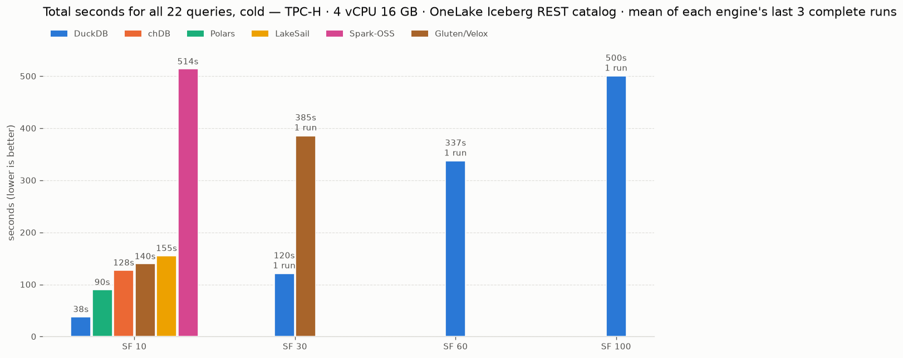
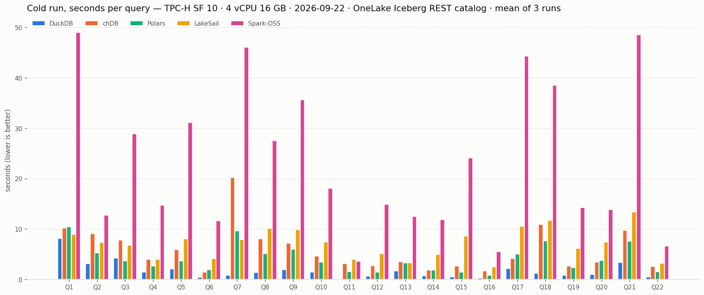
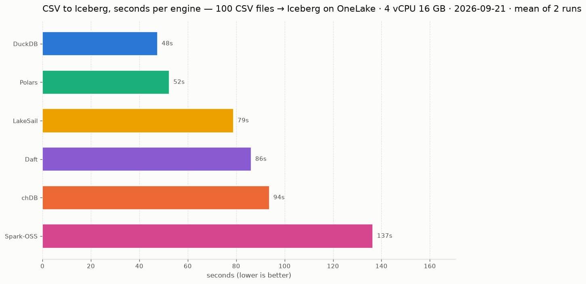

<picture>
  <source media="(prefers-color-scheme: dark)" srcset="docs/charts/totals-dark.png">
  
</picture>

<picture>
  <source media="(prefers-color-scheme: dark)" srcset="docs/charts/cold_per_query-dark.png">
  
</picture>

**Write with pyiceberg, read Back using Onelake Catalog.** 

| Engine | How it reaches the catalog | Success |
|---|---|---|
| **DuckDB** | `ATTACH … (TYPE ICEBERG, ENDPOINT …)` | yes |
| **chDB** | `CREATE DATABASE … ENGINE = DataLakeCatalog`, `catalog_type='onelake'` | yes |
| **LakeSail** | in-process Spark Connect, catalog via `SAIL_CATALOG__LIST` | yes |
| **Polars** | `pl.scan_iceberg` over a pyiceberg `RestCatalog` | yes |
| **Spark-OSS** | `spark.sql.catalog.… type=rest`, abfss via `WorkloadIdentityTokenProvider` | yes |
| **Daft** | `daft.read_iceberg` over a pyiceberg `Table` | no — 16/22, decimal overflow |
| **Comet** | Spark plugin, native Iceberg reader | no — no `abfss` driver |
| **Gluten/Velox** | Spark plugin, Velox ABFS connector | no — no published package |

OneLake is the example here, not the requirement. Any catalog that exposes an Iceberg REST
endpoint should work, and the raw data can sit on `abfss://`, `s3://` or anything else the engine
can read.

**ETL: read the CSVs from OneLake, transform, write Iceberg.** 1000 daily files are landed once in the lakehouse's `Files/` section; each engine
then reads all of them, filters and casts, and writes one Iceberg table of 149,146,763 rows into
`Tables/` through the same OneLake REST catalog.

<picture>
  <source media="(prefers-color-scheme: dark)" srcset="docs/etl/charts/totals-dark.png">
  
</picture>
