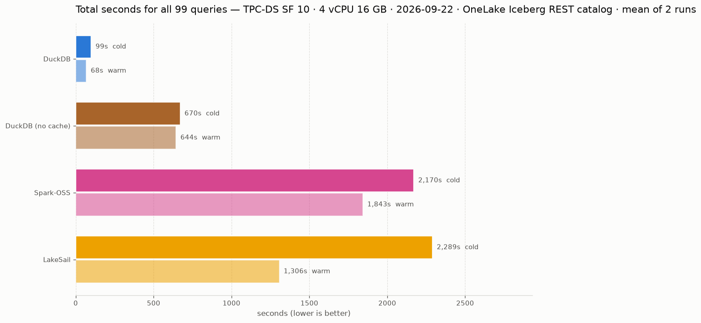

<picture>
  <source media="(prefers-color-scheme: dark)" srcset="docs/charts/totals-dark.png">
  
</picture>

<picture>
  <source media="(prefers-color-scheme: dark)" srcset="docs/tpcds/charts/totals-dark.png">
  
</picture>

<picture>
  <source media="(prefers-color-scheme: dark)" srcset="docs/etl/charts/totals-dark.png">
  
</picture>

## Adding an engine

A candidate engine must pass all three, checked by the `candidate engine` workflow:

1. **SQL**: it runs the TPC-H suite as SQL.
2. **Read from Azure**: it reads the OneLake Iceberg tables through the REST catalog, and raw files in the lakehouse Files section.
3. **Write Iceberg**: it creates and fills an Iceberg table through the same catalog.
